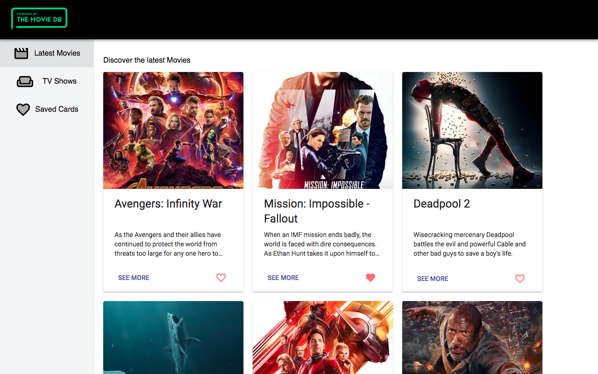
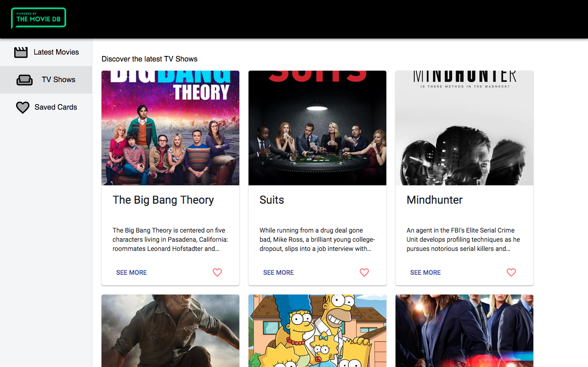
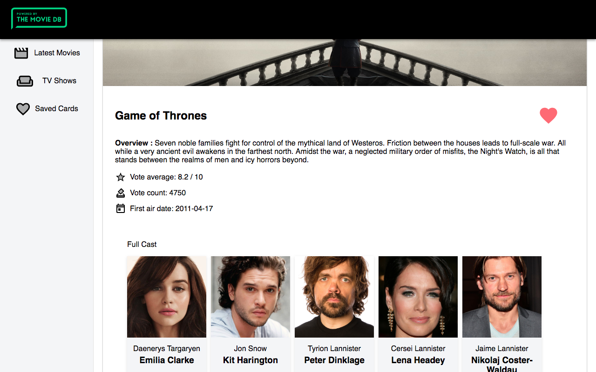

[**ReactJS-Redux-TMDb-app**](https://github.com/rashmiap/react-redux-TMDb-app)

Made with :heart: in React
-
This is a movies and TV shows app built using ReactJS and utilizes [Redux](https://redux.js.org/) for state management. [The Movie Database (TMDb) API](https://www.themoviedb.org/documentation/api) is used to fetch data. You can navigate between the latest movies and the latest TV shows. Can view full details including cast members of each movie/TV show by clicking on 'See More' button. Can locally save :heart: and unsave :broken_heart: any movie/TV show which can be viewed under 'Saved Cards' tab.
This project was bootstrapped with [Create React App](https://github.com/facebookincubator/create-react-app).

Demo
-

The app can be seen in action [here](http://redux-tmdb-app.surge.sh/).

**Run Locally**
-
 1.  Clone this repository and go into its src folder.
 2.  Run  `npm install`
 3.  Run  `npm start`
 4.  Go to  `http://localhost:3000`  to view the app
